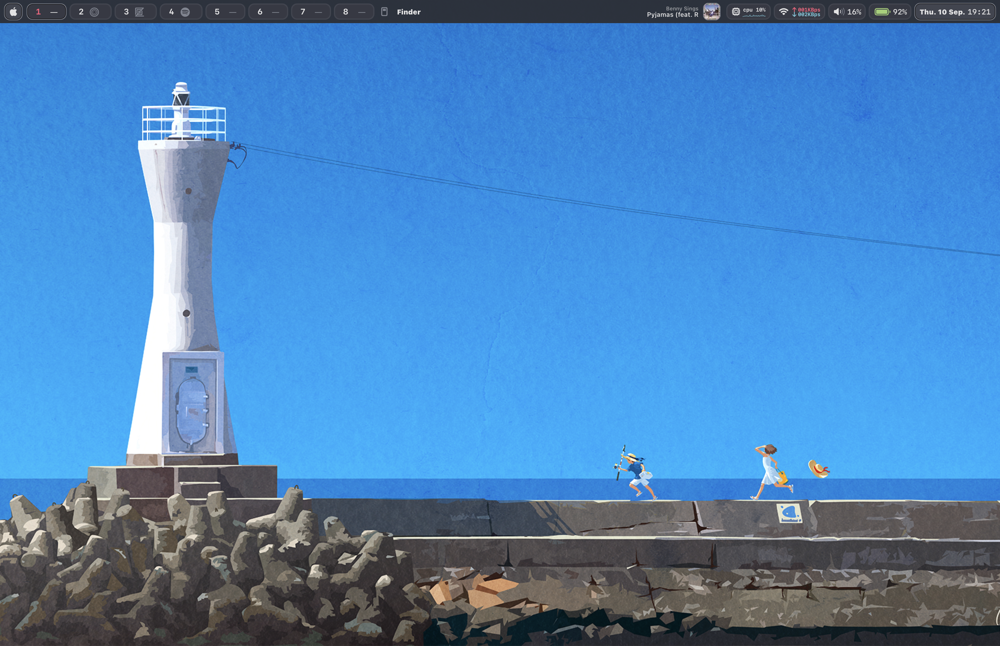

# Marmelade

Marmelade is my own macOS setup.

## Hotkeys

### Window Management

| Hotkey | Function |
|--------|----------|
| `Cmd+1..9` | Focus space 1–9 |
| `Cmd+↑/↓/←/→` | Focus window (north/south/west/east) |
| `Cmd+Shift+↑/↓/←/→` | Swap window (north/south/west/east) |
| `Cmd+Shift+1..9` | Move window to space 1–9 and focus |

### Application Shortcuts

| Hotkey | Function |
|--------|----------|
| `Cmd+Return` | Open Ghostty |
| `Cmd+E` | Open Zed |
| `F4` or `Cmd+Space` | Open Raycast |
| `F5` | Open Screenshot |

### Other shortcuts

| Hotkey | Was |
|--------|-----|
| `Ctrl+Space` | Select previous input source (macOS default) |
| `Ctrl+Option+Space` | Select next input source (macOS default) |

### Manual Steps:

- In Raycast you have to map the hotkey to be `Cmd+Space`.

## References

I got the wallpaper from <https://m-26.jp/>.

My Sketchybar Config comes from <https://github.com/FelixKratz/dotfiles>.

